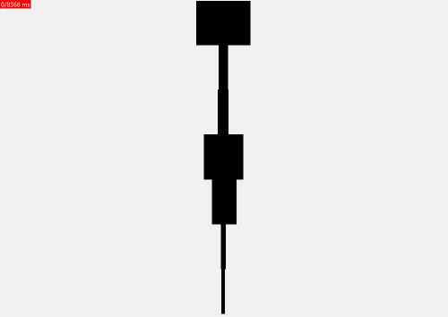

# VISU
Python spectrum viewer. Transforms live audio, using numpy FFT, into the frequency domain and renders bucket amplitudes (20Hz - 60Hz, ...). The gif below show visu "listening" to a song a rendering the frequencies it "hears."

## LED Branch
This branch contains the tools to drive an LED strip. THIS IS IN BETA!!!!! I have quickly coded up a working prototype but there is a lot of room left to imporove.

##TODO:
1. Rewrite the code to make it significantly cleaner
2. Decouple the LED driver code and the GUI
3. Add support for multiple LED strips
